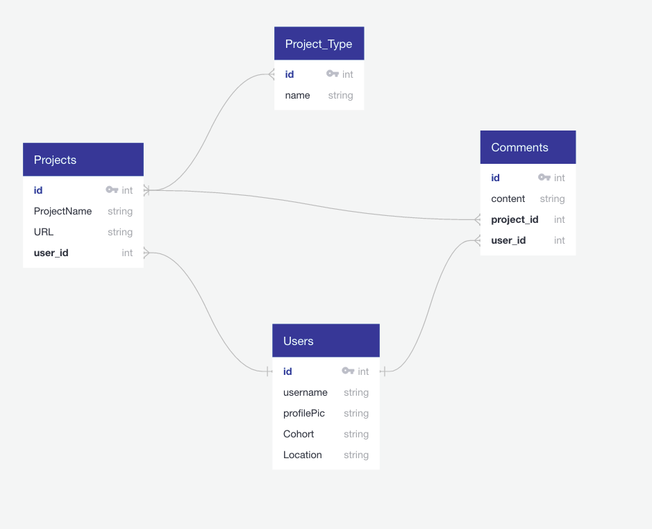
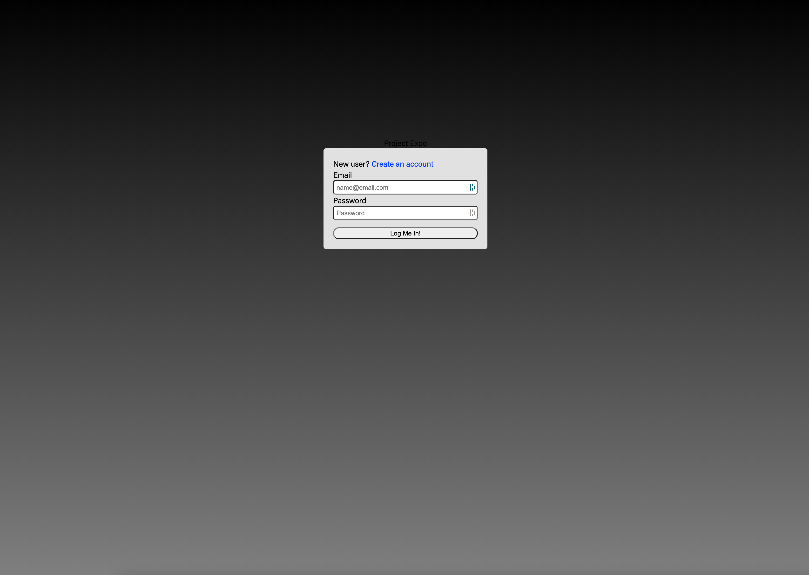
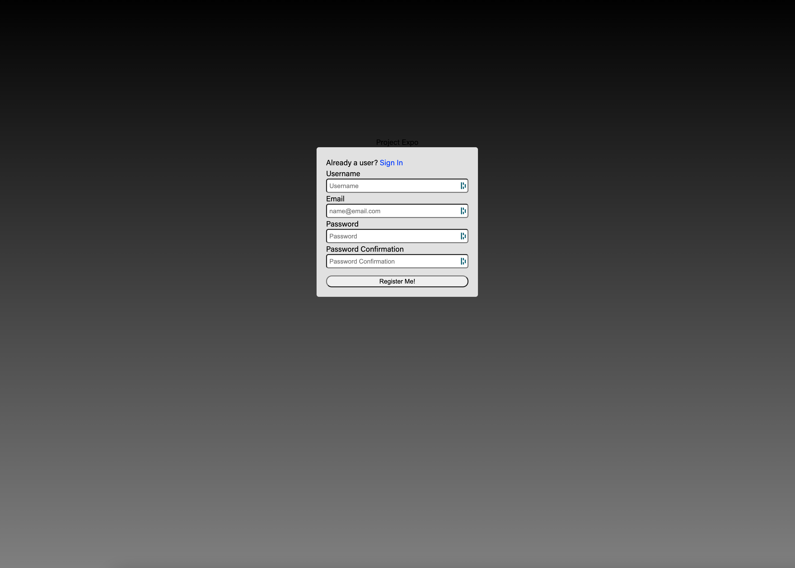
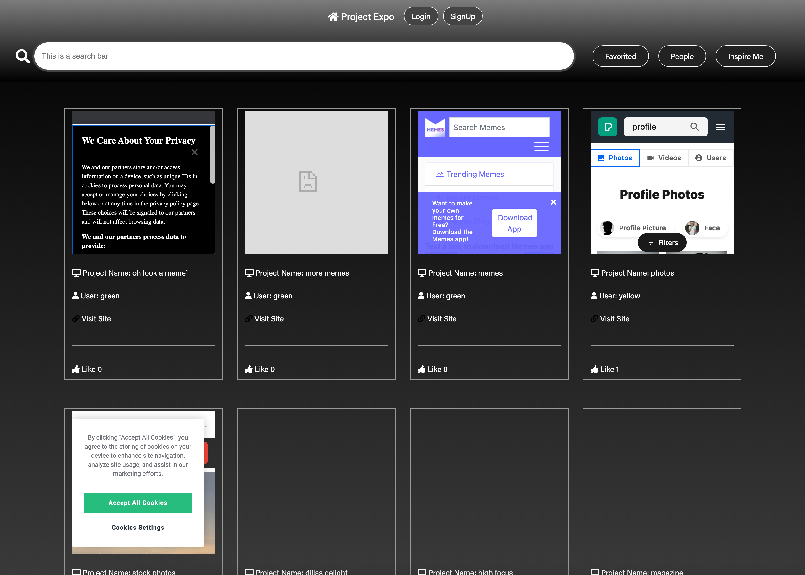
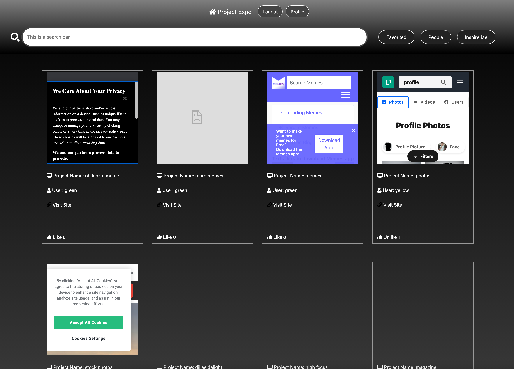
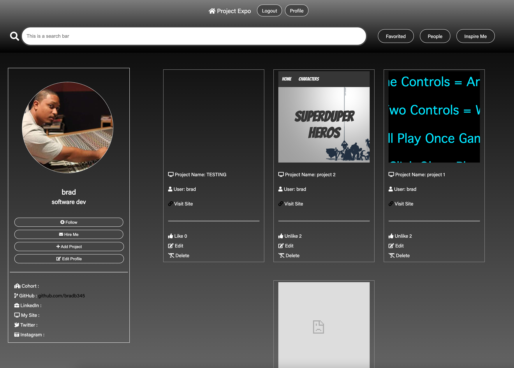

#  Project 4 - Project-Expo

  

## Brief 

All groups were given a week to create a fullstack app using a custom build Backend API utilizing Python Django and a Postgres database. The frontend was to be built using React.

## Technologies
-   **Back-End**:
    
    -   Django
    -   PostgreSQL
    -   Python
    -   Backend API  [here](https://expoback.herokuapp.com/)

-   **Front-End**:
    
    -   CSS + SASS
    -   HTML5
    -   JavaScript (ES6)
    -   React.js
    -   Google Fonts
    -   fort awesome
    
-   **Dependencies**:
    
    -   Axios
    -   Pyjwt
    -   Pip
    -   Peact-router-dom

-   **Development Tools**:
    -   Git + GitHub
    -   Heroku
    -   VS Code

## Deployment 
- click [here](https://project-expo.netlify.app/) to see the deployed App.
- click [here](https://github.com/bradb345/Server) to see the Server Github repository
- click [here](https://github.com/bradb345/Client) to see the Client Github repository

## Members

- Craig Clement - [Github](https://github.com/CraigClem)
- Gursham Singh -  [Github](https://github.com/Gursham2001) 
- Bradley Bernard - [Github](https://github.com/bradb345)

## Approach

- After a short brainstorming session we decided to create a Social Media App called “Project Expo”. It would be a place where General Assembly students could showcase their projects and serve as a one stop shop portfolio site. 

- On this project the work was first come first serve. We discussed with each other what functionality needed to be added and each member chose what they wanted to work on. 


### - Backend

####  Models
- We discussed what models we should have and the relationships they would have to each other. Below is a wireframe diagram of what our models are and the relationships between them. 



- Once these were established we set about coding the models and serializers. This was a collaborative effort. 

```py
class User(AbstractUser):
    email = models.CharField(max_length=50)
    profile_image = models.CharField(max_length=250, default='https://www.pngitem.com/pimgs/m/150-1503945_transparent-user-png-default-user-image-png-png.png')
    job_title = models.CharField(max_length=100, blank=True)
    gacohort = models.CharField(max_length=50, blank=True)
    linkedin = models.CharField(max_length=250, blank=True)
    github = models.CharField(max_length=250, blank=True)
    instagram = models.CharField(max_length=250, blank=True)
    twitter = models.CharField(max_length=250, blank=True)
    personalsite= models.CharField(max_length=250, blank=True)
    created_project = models.CharField(max_length= 250, blank=True)
``` 

- Here are the models for comments and projects.

```py
class ProjectType(models.Model):
    type = models.CharField(max_length=25)

    def __str__(self):
        return f'{self.type}'

class Project(models.Model):
    project_name = models.CharField(max_length=25)
    url = models.CharField(max_length=300)
    project_type = models.ManyToManyField(
        ProjectType,
        related_name='project',
        blank=True
    )
    favorited_by = models.ManyToManyField(
        'jwt_auth.User',
        related_name='favorites',
        blank= True
        ### ? no delete functionalities for many to many relationships
    )
    owner = models.ForeignKey(
        'jwt_auth.User',
        related_name='created_projects',
        on_delete=models.CASCADE
    )

    def __str__(self):
        return f'{self.project_name}'

class Comment(models.Model):
    content = models.TextField(max_length=250)
    project =  models.ForeignKey(
        Project,
        related_name='comments',
        on_delete=models.CASCADE
    )
    owner = models.ForeignKey(
        'jwt_auth.User',
        related_name='comments',
        on_delete=models.CASCADE
    )

    def __str__(self):
        return f'comment {self.id} on {self.project}'
```
#### Routes

- Here are the different views.

```py
class ProjectListView(APIView):

    permission_classes = (IsAuthenticatedOrReadOnly, )

    def get(self, _request):
        project = Project.objects.all()
        serialized_project = PopulatedProjectSerializer(project, many=True)
        return Response(serialized_project.data, status=status.HTTP_200_OK)

    def post(self, request):
        request.data['owner'] = request.user.id
        new_project = ProjectSerializer(data=request.data)
        if new_project.is_valid():
            new_project.save()
            return Response(new_project.data, status=status.HTTP_201_CREATED)
        return Response(new_project.errors, status=status.HTTP_422_UNPROCESSABLE_ENTITY)

class ProjectDetailView(APIView):

    # permission_classes = (IsAuthenticatedOrReadOnly, )

    def get_project(self, pk):
        try :
            return Project.objects.get(pk=pk)
        except Project.DoesNotExist:
            raise NotFound()

    def get(self, _request, pk):
        project = self.get_project(pk=pk)
        serialized_project = PopulatedProjectSerializer(project)
        return Response(serialized_project.data, status=status.HTTP_200_OK)


    def delete(self, request, pk):
        project_to_delete = self.get_project(pk=pk)
        if project_to_delete.owner != request.user:
            raise PermissionDenied()
        project_to_delete.delete()
        return Response(status=status.HTTP_204_NO_CONTENT)

    def put(self, request, pk):
        request.data['owner'] = request.user.id
        project_to_update = self.get_project(pk=pk)
        updated_project = ProjectSerializer(project_to_update, data=request.data)
        if updated_project.is_valid():
            updated_project.save()
            return Response(updated_project.data, status=status.HTTP_202_ACCEPTED)
        return Response(updated_project.errors, status=status.HTTP_422_UNPROCESSABLE_ENTITY)

class CommentListView(APIView):

    permission_classes = (IsAuthenticated, )

    def post(self, request, project_pk):
        request.data['project'] = project_pk
        request.data['owner'] = request.user.id
        serialized_comment = CommentSerializer(data=request.data)
        if serialized_comment.is_valid():
            serialized_comment.save()
            return Response(serialized_comment.data, status=status.HTTP_201_CREATED)
        return Response(serialized_comment.errors, status=status.HTTP_422_UNPROCESSABLE_ENTITY)

class CommentDetailView(APIView):

    def delete(self, request, _project_pk, comment_pk):
        try:
            comment_to_delete = Comment.objects.get(pk=comment_pk)
            if comment_to_delete.owner != request.user:
                raise PermissionDenied()
            comment_to_delete.delete()
            return Response(status=status.HTTP_204_NO_CONTENT)
        except Comment.DoesNotExist:
            raise NotFound()

class ProjectFavoriteView(APIView):

    permission_classes = (IsAuthenticated, )

    def post(self, request, pk):
        try:
            project_to_favorite = Project.objects.get(pk=pk)
            if request.user in project_to_favorite.favorited_by.all():
                project_to_favorite.favorited_by.remove(request.user.id)
            else:
                project_to_favorite.favorited_by.add(request.user.id)
            project_to_favorite.save()
            serialized_project = PopulatedProjectSerializer(project_to_favorite)
            return Response(serialized_project.data, status=status.HTTP_202_ACCEPTED)
        except Project.DoesNotExist:
            raise NotFound()
 ```

 ```py
class RegisterView(APIView):

    def post(self, request):
        print(request.data)
        user_to_create = UserSerializer(data=request.data)
        if user_to_create.is_valid():
            user_to_create.save()
            return Response(
                {'message: Registration Successfull'},
                status=status.HTTP_201_CREATED
            )
        return Response(user_to_create.errors, status=status.HTTP_422_UNPROCESSABLE_ENTITY)

class LoginView(APIView):

    def post(self, request):
        email = request.data.get('email')
        password = request.data.get('password')

        try:
            user_to_login = User.objects.get(email=email)
        except User.DoesNotExist:
            raise PermissionDenied({'detail': 'Unauthorized'})

        if not user_to_login.check_password(password):
            raise PermissionDenied({'detail': 'Unauthorized'})

        expiry_time = datetime.now() + timedelta(days=7)
        token = jwt.encode(
            {'sub': user_to_login.id, 'exp':  int(expiry_time.strftime('%s'))},
            settings.SECRET_KEY,
            algorithm='HS256'
        )
        return Response(
            {'token': token, 'message': f'Welcome back {user_to_login.username}'}
        )

class ProfileDetailView(APIView):
    def get(self, _request, pk):
        try:
            user = User.objects.get(pk=pk)
            serialized_user = PopulatedUserSerializer(user)
            return Response(serialized_user.data, status=status.HTTP_200_OK)
        except User.DoesNotExist:
            raise NotFound()

    def put(self, request, pk):
        request.data['owner'] = request.user.id
        user_to_update = User.objects.get(pk=pk)
        updated_user = UserSerializer(user_to_update, data=request.data)
        if updated_user.is_valid():
            updated_user.save()
            return Response(updated_user.data, status=status.HTTP_202_ACCEPTED)
        return Response(updated_user.errors, status=status.HTTP_422_UNPROCESSABLE_ENTITY)


class ProfileView(APIView):
    def get(self, _request):
        user = User.objects.all()
        serialized_user = PopulatedUserSerializer(user, many=True)
        return Response(serialized_user.data, status=status.HTTP_200_OK)

```

### - Frontend

#### Feeds

-  For the projects, I made a try catch async function that makes a GET request to the backend server to get all the projects. after awaiting the request, If the request was successful I set the response data to state, if the request failed I set the isError state to true. If there was no error but the projects state is still null, then that means that isLoading is true. If any of these states and constants are true then a message is conditionally rendered to the page.

```js
const [projects, setProjects] = React.useState(null)
const [isError, setIsError] = React.useState(false)
const isLoading = !posts && !isError
  ```

- In the useEffect function I set the searchTerm prop in the array dependency so that when those values change it will trigger a re-render to the page.

```js
React.useEffect(() => {
    const getData = async () => {
      try {
        const response = await getAllProjects()
        setProjects(response.data.reverse())
      } catch (error) {
        setIsError(true)
      }
    }
    getData()
  }, [searchTerm])
```

- I then filtered the response of the GET request and passed the key values into the ProjectCard component where each result was mapped. If id was true then the user was on a specific profile and would only see projects that belonged to that id. If id was false then that meant that the user was on the main feed and wanted to see all the projects. 

```js
const filterProjects = (id) => {
    return (
      projects.filter(project => {
        if (id) {
          return (
            (project.projectName.toLowerCase().includes(searchTerm)) &&
            (project.owner.id === id)
          )
        }
        return (
          (project.projectName.toLowerCase().includes(searchTerm) ||
          project.owner.username.toLowerCase().includes(searchTerm))
        )
      })
    )
  }

  return (
    <>
      <div className="ProjectIndex-Container">
        {isError && <Error />}
        {isLoading && <Loader
          type="TailSpin"
          color="#F70C0C"
          height={80}
          width={80} //3 secs
        />}

        {projects &&
          filterProjects(idToNum).map((project) => (
            <ProjectCard
              key={project.id}
              url={project.url}
              projectName={project.projectName}
              username={project.owner.username}
              owner={project.owner.id}
              handleUpdateProjects={handleUpdateProjects}
              projectId={project.id}
              likedByArray={project.favoritedBy}
            />

          ))}
      </div>
    </>
  )
``` 

#### Like functionality

- I took on the task of Like functionality. the likedByArray is a property of a project which is passed into the ProjectCard as a prop. I then take that array and determin if the user has liked that project already and conditionally render the like or unlike button on the page. the likedByArray is in the dependancy array so that if it changes it then triggers a re-render to the page. 

- The handleLike function passes the res.data back to the Project Index compenent where that updated project is then remapped to reflect the new updates.

```js
React.useEffect(() => {
    likedByArray.some(like => like.id === getCurrentUserId()) ? setLikeText('Unlike') : setLikeText('Like')
  }, [likedByArray])

  const handleLike = async (event) => {
    event.stopPropagation()
    console.log()
    if (!isAuthenticated()) {
      history.push('/auth')
    }
    if (likedByArray.includes(getCurrentUserId())) {
      setLikeText('Unlike')
    } else {
      setLikeText('Like')
    } 
    console.log(likedByArray)
    try {
      const res = await likeProject(projectId)
      handleUpdateProjects(res.data)
      
    } catch (err) {
      console.log(err)
    }
  }
```
```js
const handleUpdateProjects = (updatedProject) => {

    const updatedProjects = projects.map((project) => {
      if (updatedProject.id !== project.id) {
        return project
      } else if (!updatedProject) {
        location.reload()
      }
      return updatedProject

    })

    setProjects(updatedProjects)
  }
```

## Screenshots

Login

Register

Unregistered Main feed

Registered Main feed

Profile feed


### Wins and Challenges 

#### - Challenges

- Wrapping my head around Django was the main challenge of this project.
- This being the first project using python was another challenge as well.

#### - Wins

-  Coming away with a better understanding of Python and its similarity with JavaScript.

- Throughout the project, I was considered to be the main debugger. Whenever my group mates had a problem they would ask me to take a look at their code and help them figure out what’s causing their particular issue. It made me feel like I knew what I was doing. 


### Key Learning

- Django is a great tool for building responsive, fuctional websites fast. It really cut down the amout of code you write.
- When I started GA I was hoping that we would learn Python. So when we started this project I was excited to learn the language. 
- Before this project I never worked with postgreSQL Tables. It was difficult wrapping my head around the relationships between different tables, but by the end of the project I believe I have a better understanding of how they interact.  

### Future Improvements 
- I’m currently in the process of re-styling the entire website. I plan to utilize Material-UI to make the site look more professional. 


### Bugs

- The site calls multiple different sites all at once upon loading. This could slow the site loading speed, especially if the site grows in users. I need to figure out how to load the projects to the page as needed. 

- The Inspire me and Favorites buttons dont work as yet, as our group ran out of time. 